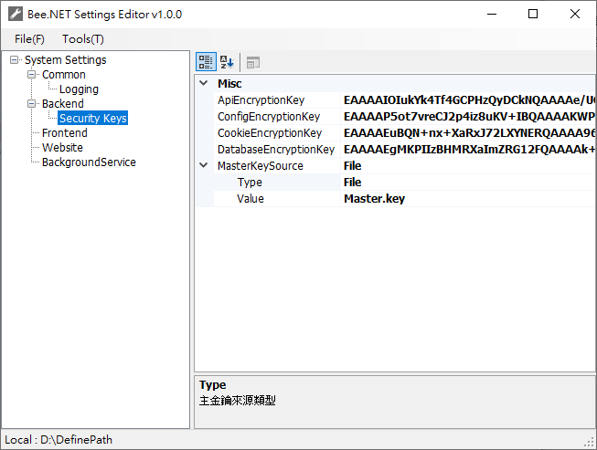

# 🛠️ BeeSettingsEditor 工具

`BeeSettingsEditor.exe` 是專為 `Bee.NET` 設計的設定檔視覺化編輯與加密金鑰管理工具，主要功能包括：

- 視覺化編輯 `SystemSettings.xml` 與 `DatabaseSettings.xml`
- 建立主金鑰檔案（`Master.key`）
- 產生 API、Cookie、Config、Database 等加密金鑰，並使用主金鑰進行加密儲存

---

## 📦 工具下載

| 版本   | 更新日期    | 說明                             | 下載連結 |
|--------|-------------|----------------------------------|----------|
| v1.0.0 | 2025-07-25  | 初版釋出，支援主金鑰與加密金鑰產生 | [📥 Download v1.0.0](https://github.com/jeff377/bee-library/releases/download/BeeSettingsEditor-v1.0.0/BeeSettingsEditor-v1.0.0.zip) |
| v1.0.1 | 2025-07-27  | 支援 `Bee.NET v3.2.1` 的 `SystemSettings` 新增功能項目  | [📥 Download v1.0.1](https://github.com/jeff377/bee-library/releases/download/BeeSettingsEditor-v1.0.1/BeeSettingsEditor-v1.0.1.zip) |
| v1.0.2 | 2025-07-28  | BeeSettingsEditor.exe 啟動時，主金鑰不存在會自動產生，避免因缺少主金鑰而導致應用程式中斷。  | [📥 Download v1.0.2](https://github.com/jeff377/bee-library/releases/download/BeeSettingsEditor-v1.0.2/BeeSettingsEditor-v1.0.2.zip) |
| v1.0.3 | 2025-08-01  | 支援 `Bee.NET v3.2.2` 的 `SystemSettings` 新增功能項目  | [📥 Download v1.0.3](https://github.com/jeff377/bee-library/releases/download/BeeSettingsEditor-v1.0.3/BeeSettingsEditor-v1.0.3.zip) |
| v1.0.4 | 2025-08-17  | 支援 `DatabaseSettings` 的 Password 加密  | [📥 Download v1.0.4](https://github.com/jeff377/bee-library/releases/download/BeeSettingsEditor-v1.0.4/BeeSettingsEditor-v1.0.4.zip) |
| v1.0.5 | 2025-08-18  | 屬性視窗描述文字改為英文  | [📥 Download v1.0.5](https://github.com/jeff377/bee-library/releases/download/BeeSettingsEditor-v1.0.5/BeeSettingsEditor-v1.0.5.zip) |
| v1.0.6 | 2025-09-24  | 支援 `Bee.NET v3.2.8` 的 `SystemSettings` 新增功能項目  | [📥 Download v1.0.6](https://github.com/jeff377/bee-library/releases/download/BeeSettingsEditor-v1.0.6/BeeSettingsEditor-v1.0.6.zip) |
| v1.0.7 | 2025-10-05  | 支援 `Bee.NET v3.5.1` 的 `SystemSettings` 新增功能項目  | [📥 Download v1.0.7](https://github.com/jeff377/bee-library/releases/download/BeeSettingsEditor-v1.0.7/BeeSettingsEditor-v1.0.7.zip) |
| v1.0.8 | 2025-10-28  | 支援 `Bee.NET v3.6.1` 的 `SystemSettings` 新增功能項目  | [📥 Download v1.0.8](https://github.com/jeff377/bee-library/releases/download/BeeSettingsEditor-v1.0.7/BeeSettingsEditor-v1.0.8.zip) |

---

## 🖼 操作畫面預覽

以下為工具操作介面截圖：

---

## 🚀 快速使用指南（首次使用）

1. 執行 `BeeSettingsEditor.exe`
2. 首次啟動時會出現 `Set API Connection Endpoint` 視窗（目前僅支援近端連線）
3. 輸入 `DefinePath/` 目錄路徑（需包含 `SystemSettings.xml` 與 `DatabaseSettings.xml`）
   - 若指定目錄尚未包含上述檔案，工具將自動建立空白範本
4. 點選 `Tools → Generate Master Key...` 建立主金鑰檔（`Master.key`）
   - 建議將主金鑰儲存於 `DefinePath/` 目錄中
5. 建立主金鑰後，請重新啟動工具以正確載入金鑰
6. 點選 `Tools → Generate API Encryption Key` 建立 API 加密金鑰，並自動以主金鑰加密
7. 點選 `File → Save Current Settings` 儲存目前設定至 `SystemSettings.xml`
8. 建立的 API 金鑰將用於 JSON-RPC 傳輸資料的加密作業

---

## 🛡️ 安全建議

- `Master.key` 為系統主金鑰，**請勿提交至版本控制系統**
- 應妥善保存在部署環境中，並確保其存取權限受到控管

---

## 🔗 延伸閱讀與相關資源

- [JSON-RPC 加密與設定指南（HackMD）](https://hackmd.io/@jeff377/bee-settings-guide)
- [Bee.NET 架構說明與組件結構（HackMD）](https://hackmd.io/@jeff377/bee-architecture)
